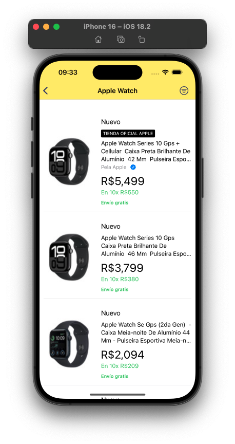
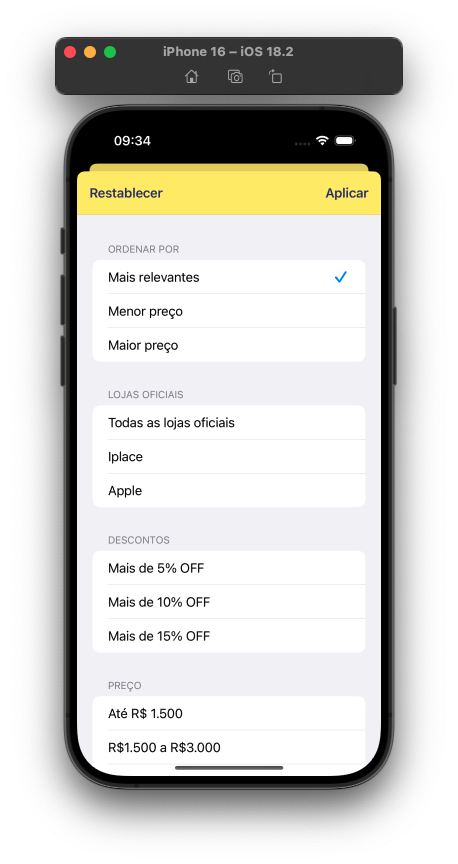
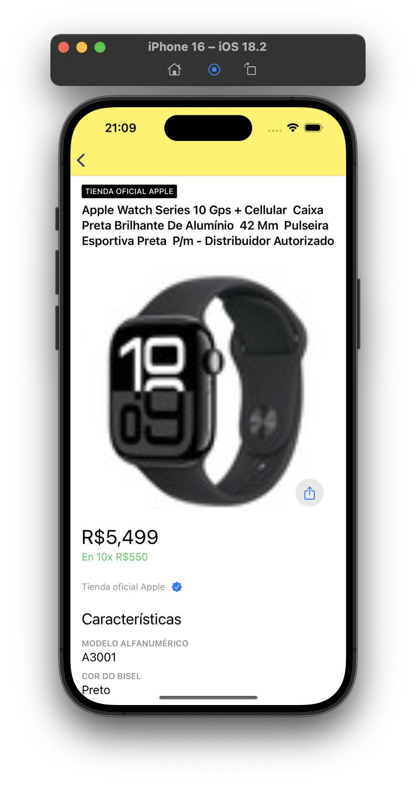

# 📌 Desafío iOS Engineer - Mercado Libre  

¡Hola! Gracias por evaluar mi desafío para la posición de **iOS Engineer**. A continuación, explico algunas decisiones técnicas, la arquitectura utilizada y puntos clave del desarrollo.  

## 🛠 Requisitos  
- **Xcode 16**  
- **iOS 17**

## ✅ Cobertura de Pruebas  
Decidí centrarme en las pruebas unitarias de la **lógica de negocio**. También probé algunos elementos de la interfaz de usuario, como la configuración de botones e interacciones básicas.  

- **Cobertura general**: 34%  
- **Cobertura de la lógica de negocio**: ~85%  

## 📌 Arquitectura  
Utilicé un enfoque híbrido combinando **MVVM Clean Architecture** y **MVC**, según la complejidad de cada pantalla:  

- **MVVM** se aplicó en la **pantalla de búsqueda**, ya que requería una lógica más extensa y una mejor separación de responsabilidades.  
- **MVC** se utilizó en pantallas más simples para mantenerlas compactas y fáciles de mantener.  

También implementé **SwiftUI** en ciertas partes específicas, como en la **tarjeta de búsqueda** (dentro de una `UICollectionViewCell` con `UIHostingController`) y en la **pantalla de detalles**. Esto permitió acelerar el desarrollo de las interfaces.  

## 🔍 Sobre el Desafío  
Implementé un flujo simple compuesto por:  
1. **Pantalla de búsqueda** (donde el usuario ingresa su consulta)  
2. **Pantalla de resultados de búsqueda**, con **paginación** y opción de **filtros**  
3. **Pantalla de detalles del producto**, incluyendo un botón de **compartir**  

### 📌 Decisiones Técnicas  
- El **site ID** está fijado en **MLB**. Inicialmente, consideré detectar la moneda predeterminada del dispositivo y compararla con la API de sitios de Mercado Libre, pero prioricé otras partes del proyecto.  
- Para la pantalla de **detalles**, quería usar el endpoint de `search items`, pero requería un **access token**. Como alternativa, reutilicé el objeto recibido de la búsqueda para mostrar los detalles del producto.  
- El botón de **compartir** en la pantalla de detalles permite compartir la **URL del permalink** proporcionada por la API.  

## 📱 Pantallas Implementadas  
✔ **Búsqueda por consulta**  
✔ **Resultados de búsqueda**, con **paginación**  
✔ **Filtros de búsqueda**  
✔ **Detalle del producto**, con **opción de compartir**  

## 📱 Compatibilidad con modos de pantalla
La aplicación es compatible con **todos los modos de orientación**:
- **Retrato (vertical)**
- **Paisaje (horizontal)**

Se ha diseñado para ofrecer una experiencia fluida en cualquier orientación de la pantalla.

## 🌍 Localización  
La aplicación está **totalmente localizada** en tres idiomas:  
- **Portugués**  
- **Inglés**  
- **Español**  

La traducción se realizó utilizando **Localizable.strings**, lo que garantiza que la interfaz y los mensajes del sistema se muestren en el idioma correcto según la configuración del dispositivo.  

## ⏳ Pantalla de Carga  
Implementé una **pantalla de carga** para mejorar la experiencia del usuario mientras se recuperan los datos.  

## ⚠️ Manejo de Errores  
Se implementaron pantallas de error para distintos escenarios, asegurando que el usuario reciba mensajes claros y tenga la opción de volver a intentarlo.  

### Tipos de Errores Tratados  
1. **Búsqueda sin resultados** → Se muestra un mensaje indicando que no hay productos disponibles para la búsqueda realizada.  
2. **Error de conexión** → Si el dispositivo no tiene acceso a internet, se muestra un mensaje específico.  
3. **Error devuelto por la API** → Se decodifica el error recibido y se muestra el mensaje enviado por la API.  
4. **Error genérico** → Para casos inesperados, se muestra un mensaje estándar.  

> Todas las pantallas de error incluyen un botón de **Reintentar**, permitiendo al usuario intentarlo nuevamente.  

## 🔗 Deep Link  
Implementé un **Deep Link** para la **pantalla de búsqueda**, utilizando un enfoque basado en **Type-Driven Design**. El esquema permite recibir los siguientes parámetros:  
- **query** (término de búsqueda)  
- **site ID**  
- **category ID**  

### Prueba del Deep Link en el Simulador  
Para probarlo en el simulador, puedes ejecutar el siguiente comando:  
```sh
xcrun simctl openurl booted "challenge-ml://search?q=Apple%20Watch&siteId=MLB&category=MLB135384"
```

## 📦 Librerías Utilizadas  
- **Alamofire** → Utilizado para manejar las solicitudes de red, errores y caché.  
- **Mocker** → Utilizado exclusivamente en los **tests unitarios** para inyectar JSONs y simular respuestas de la API, interceptando las solicitudes y devolviendo valores específicos para entornos de prueba controlados.  

## 🔒 Consideraciones de Seguridad  
Para mostrar las imágenes de los productos, fue necesario habilitar **Allow Arbitrary Loads** en **Info.plist**, ya que algunas imágenes son servidas a través de **HTTP** en lugar de **HTTPS**.  

## Screenshots

Aquí tienes algunas capturas de pantalla de la aplicación:

<p align="center">
  
  
  
  
</p>